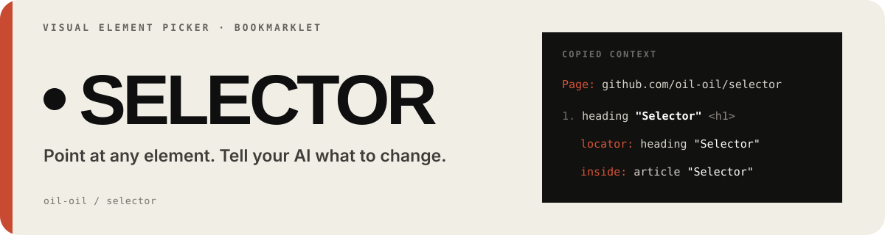
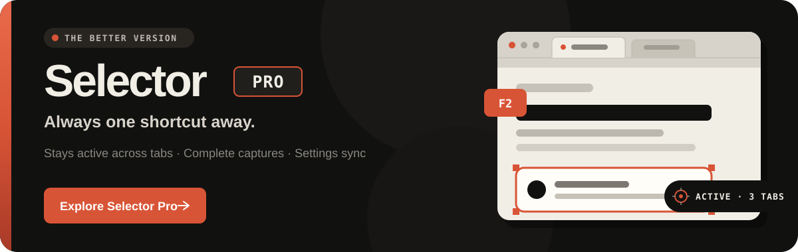

<p align="center">
  
</p>

A bookmarklet for selecting web elements and copying structured context into Claude Code, Codex, Cursor, or any AI coding assistant.

https://github.com/user-attachments/assets/fb8e9271-d7e0-487f-b013-106cc4c5a40f

## Install

1. Visit the **[install page](https://oil-oil.github.io/selector/)**
2. Drag the **Selector** button to your bookmarks bar (one-time)
3. Done

The install page follows your browser language and includes an English / Chinese toggle.

## Usage

Open any web page, click the **Selector** bookmark.

| Action | What it does |
|---|---|
| **Click** | Select an element |
| **Shift + Click** | Add to selection |
| **Drag** | Marquee select multiple elements |
| **↑ / ↓** | Navigate to parent / child element |
| **← / →** | Navigate to previous / next sibling |
| **✎ button** | Add per-element instruction |
| **⌘C** | Copy prompt to clipboard |
| **⌘M** | Copy selected content as Markdown |
| **⌘⇧C** | Copy selected area screenshot |
| **⌘Z** | Undo last selection change |
| **F2** | Pause / resume element selection |
| **Esc** | Clear the current selection or close the current popover |

Copied prompts include the element name, stable locator, semantic location, and React details, with CSS, layout, parent, or HTML context added only when useful. Long URLs are reduced to the route and key query values.

Enable **Sharingan mode** for higher-fidelity recreation. **⌘C** then captures document context, geometry, sanitized DOM, effective styles and states, fonts, animations, media, React details, and nearby context. Small reports go to the clipboard; large ones download as `.md` files.

With **Screenshot + text combined** enabled, **⌘C** copies the prompt and selected-area screenshot, downloads the PNG, and adds its local path to the prompt for text-only AI inputs.

## Example output

```
Page: https://example.com/dashboard?tab=overview

1. Hero "Welcome to the Dashboard" <h1>
   selector: [data-testid="hero-title"]
   locator: heading "Welcome to the Dashboard"
   source: src/components/Hero.tsx:12
   react: Layout › Hero
   instruction: Make this red and larger

2. nav "Home Settings Profile Logout" <nav>
   locator: nav "Home Settings Profile Logout"
   inside: main "Dashboard"
   instruction: Add an "Analytics" link after "Settings"
```

For long filtered pages, the copied prompt is shortened like this:

```
Page: http://localhost:3000/campaigns/2079fa76-9c77-4900-b11a-086f4464ff2b/settlement
Query: date_from=2026-05-23, date_to=2026-06-22, creator_ids ×2
```

## How it works

Selector injects its compiled assets into the current page and runs entirely client-side — no data is sent anywhere. The build bundles the editor and Sharingan mode into the bookmark, so it works offline after installation.

## Selector Pro

Use **[Selector Pro](https://selector-pro.org/)** for one-shortcut access across tabs, complete captures without dialogs, and synced settings.

<p align="center">
  <a href="https://selector-pro.org/"></a>
</p>

## Development

```bash
git clone https://github.com/oil-oil/selector.git
cd selector
npm ci
npm run build
# Source files:
#   assets/editor.css     — styles for the in-page editor UI
#   src/*.js              — editor source fragments assembled by scripts/build.js
#   src/sharingan.js      — Sharingan-mode replication report, inlined at build time
# Push to main — GitHub Actions builds dist/ and deploys GitHub Pages
```

<p align="center">
  <a href="https://github.com/oil-oil/beautify-github-readme"></a>
</p>

## License

MIT
